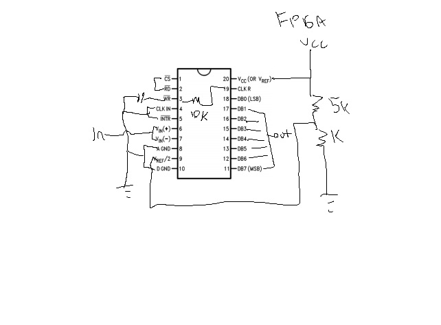

Final Project - Digital Oscilloscope
=========

C2C John Miller

Original Proposal: 
---
Create a system that will :
* Be able to take an image of an NES emulator from a laptop screen via VGA 
* Analyze the image and determine the location of an obstacle on screen
* Determine the appropriate move for Mario to perform
* Send that command via usb output

Unfortunately, the AI project did not work, so within 3 days of work, myself, C2C Mordan, and C2C Taormina created a digital Oscilloscope

Original Detailed Tasks and Schedule
---
* Find a working Super Mario Bros. Rom
* Figure out how to analyze the VGA signal and interpret the colors ( LSN 35)
* Make sure that the data accurately represents the visuals on screen (LSN 35/36)
* Create code to correctly identify an obstacles position relative to Mario (LSN 36/37)
* Create code to determine the proper action to take (Jump or move forward)
(LSN 37)
* Be able to interface the FPGA with the USB input on the laptop to actually control Mario (LSN 38)

The new schedule became a bit more convoluted as we rushed to complete it, so I took on the analog tasks in terms of wiring up the ADC0803.

Original Functionality Levels
---
* Required: Mario is able to successfully jump onto the goomba on the first screen
* B: Mario can make it past the first pit obstacle
* A: Mario finishes level 1-1

New functionality 
---
* Required: Get ADC0803 to work (Achieved)
* B: Get ADC to interface with FPGA (Achieved)
* A: Create VHDL code to smooth out the display signal (In progress)

Overall, I achieved all of B and most of A functionality, so B and then some.

Troubleshooting
---
* ADC datasheet was a tad convoluted, so figuring out how to actually wire it up was a pain
* After hours of wiring, I finally got the ADC to work, and the output was accurate on the logic analyzer, I then had trouble getting it to interface with the FPGA.
* It finally dawned on me that the ADC outputs whatever the input voltage is as a logic high, so I wired in the VCC and GND outputs of the FPGA as the voltage source for the ADC0803.

Implementation
---
* None of the code in the directory is from my VHDL, to see that, go to C2C Taormina and C2C Mordan's directories. My implemented work was all on the ADC.
* The schematic of the adc is below

* A video of it operating is posted below

